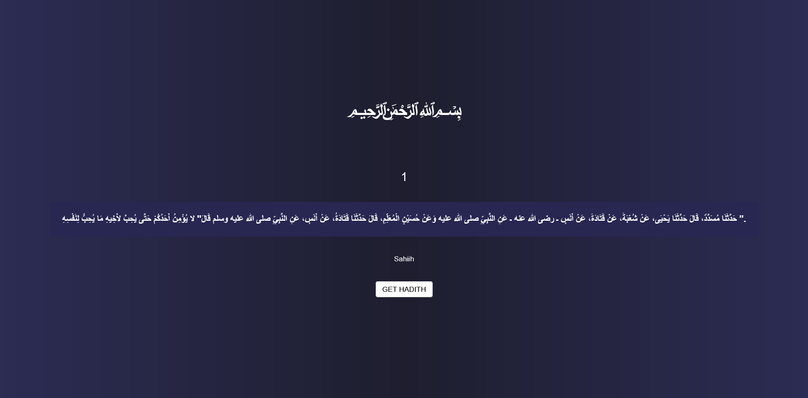

# 🕌 Random Hadith Viewer

This is a **mini-project** built using modern JavaScript (ES6+) that fetches and displays a **random hadith** using a public API. It's lightweight, responsive, and a perfect example of using `async/await` and `fetch()` for working with APIs in JavaScript.

---

## 📸 Demo



---

## 🌟 Features

- ✅ Get a new random hadith at the click of a button
- ✅ Clean and minimal UI
- ✅ Asynchronous data fetching with `async/await`
- ✅ Error handling for broken API or internet issues
- ✅ Responsive design – works on all devices

---

## 🛠️ Tech Stack

- **HTML5**
- **CSS3**
- **JavaScript (ES6+)**
- **Fetch API**
- **Async/Await**

---

## 🌐 API Source

Hadiths are fetched from a public API (you can replace with your actual source):

👉 [Hadithi API](https://hadithapi.com/docs/hadiths)  
_(Or any free hadith API you used)_

---

## 🚀 How to Use

1. Clone this repository  
   ```bash
   git clone https://github.com/yourusername/random-hadith-viewer.git
   cd random-hadith-viewer
    Open index.html in your browser

    Click on the "Get Hadith" button to view a random hadith

    Enjoy!

🙏 Acknowledgements

    Thanks to the API providers for making this data publicly available.

    Special thanks to the developers and the community contributing to Islamic content online.

📃 License

This project is licensed under the MIT License.
Feel free to use, modify, and share!
✨ Author

 MR.Abdiladiif Abdisamed
🔗 MaxSulTech.com
📧 cabdiladiifcabdisamed@gmail.com